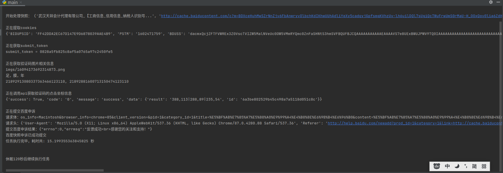
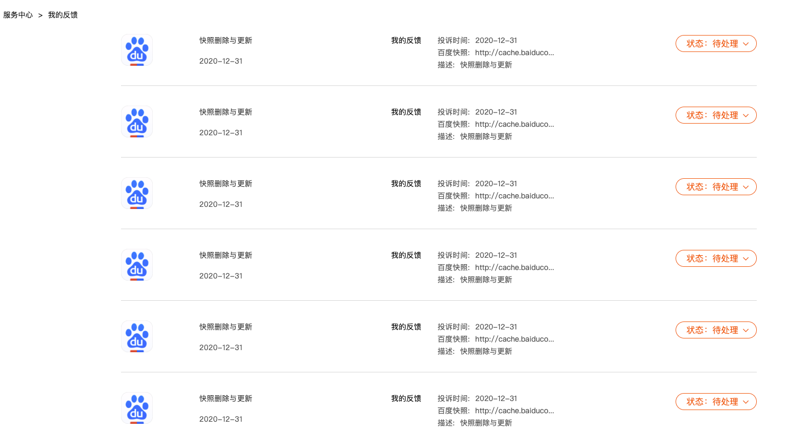

#### 一、介绍

- 半自动提交【删除百度快照】申请的脚本，Cookie需要手动获取替换，验证码识别用的是[图鉴](http://www.ttshitu.com/) <br><br>

- 1、安装依赖及环境
```
pip install -r requirements.txt
```

- 2、修改setting.py中的配置信息
  - 三个必要的配置项：
    - 验证码识别api的用户名、密码
    - 百度查询关键词
    - 百度账号登录后的Cookie
  <br><br>

- 3、运行：
```
python main.py
```



- 4、其他说明：
    - 2020.12.31正常运行


### 技术交流
- [Join Discord >>](https://discord.com/invite/eRuSqve8CE)
- WeChat：`SamgeApp`
